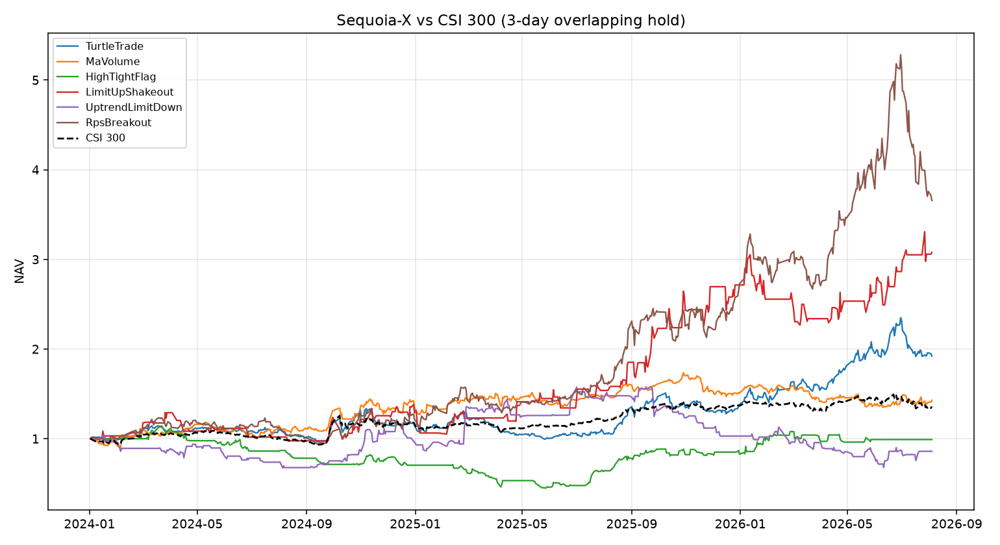

# Sequoia-X 策略回测报告

对照 [sngyai/Sequoia-X](https://github.com/sngyai/Sequoia-X) V2 六个日频选股规则，在沪深300+中证500 成分股上做历史回测。

## 回测设定

- **样本区间**：2024-01-02 ~ 2026-08-04（行情从 2023-01-03 起，用于均线 / RPS 热身）
- **股票池**：当前沪深300 + 中证500 成分股，剔除 ST / 北交所，共 **800** 只
- **行情**：baostock 后复权日 K，与原项目一致
- **信号**：收盘后用当日及以前的数据选股（无盘中未来函数）
- **成交**：T+1 开盘买入；若次日一字涨停或停牌则不成交
- **每日上限**：每个策略最多 10 只，按当日成交额从大到小
- **事件研究**：买入后持有至 T+N 收盘，不计费用
- **组合**：持有 **3** 个交易日、持仓等权；买入 5bp、卖出 10bp（含印花税）
- **对照**：沪深300 同期买入持有

## 重要偏差

- 成分股取**当前**成员，存在幸存者偏差，偏利好历史表现。
- 原仓库只做选股推送，没有官方卖出规则；3 日持有是对「推完就买」的一种可复现假设。
- 定增策略依赖东方财富公告，未纳入本次回测。
- 涨停判定统一用 9.5%（创业板/科创板实际 20%），与原代码一致。
- 信号稀疏的策略（涨停洗盘、上升跌停）经常满仓 1～2 只，净值波动不能和每天 10 只的海龟 / RPS 直接比。

## 组合表现（3 日重叠持有）

| 策略 | 总收益 | 年化 | 最大回撤 | 波动 | 夏普 | 有信号天数 | 买入笔数 |
|---|---:|---:|---:|---:|---:|---:|---:|
| 海龟突破 TurtleTrade | 92.02% | 28.68% | -25.59% | 29.45% | 1.04 | 625 | 5898 |
| 均线放量 MaVolume | 42.88% | 14.79% | -22.16% | 28.16% | 0.65 | 573 | 3004 |
| 高窄旗形 HighTightFlag | -0.93% | -0.36% | -60.81% | 31.11% | 0.14 | 213 | 576 |
| 涨停洗盘 LimitUpShakeout | 207.76% | 54.42% | -25.76% | 46.85% | 1.20 | 87 | 113 |
| 上升跌停 UptrendLimitDown | -14.05% | -5.68% | -57.07% | 42.22% | 0.06 | 117 | 173 |
| RPS 突破 RpsBreakout | 265.68% | 65.06% | -30.78% | 39.55% | 1.52 | 623 | 6075 |
| 沪深300 买入持有 | 35.87% | 12.58% | -15.66% | 18.86% | 0.75 | 626 | — |



## 结论（3 日持有）

- 同期沪深300 总收益 35.87%。跑赢指数的组合：**海龟突破 TurtleTrade、均线放量 MaVolume、涨停洗盘 LimitUpShakeout、RPS 突破 RpsBreakout**。
- 跑输或接近亏损：**高窄旗形 HighTightFlag、上升跌停 UptrendLimitDown**。高窄旗形是整理形态不是买点；上升跌停 3 日中位数为负，均值被少数大反弹拉高。
- 3 日事件研究里，多数策略**均值正、中位数负、胜率不到 50%**，收益来自右尾，不是稳定胜率。
- 涨停洗盘 3 日均收益约 1%、胜率 57%，但只有约 110 笔，且经常满仓 1 只，回撤和容量都经不起当主策略。
- 海龟 / RPS 几乎每天都有满额 10 只信号，3 日持有比更长持有更干净；RPS 年化最高，回撤也到 30% 以上。

## 事件研究（T+1 开盘买入后的平均收益）

### 持有 1 个交易日

| 策略 | 样本数 | 平均 | 中位数 | 胜率 | P25 | P75 |
|---|---:|---:|---:|---:|---:|---:|
| 海龟突破 TurtleTrade | 5898 | 0.29% | -0.03% | 48.4% | -1.75% | 1.90% |
| 均线放量 MaVolume | 3004 | 0.23% | -0.03% | 48.0% | -1.41% | 1.58% |
| 高窄旗形 HighTightFlag | 576 | -0.02% | -0.18% | 46.9% | -1.69% | 1.31% |
| 涨停洗盘 LimitUpShakeout | 113 | 0.96% | 0.39% | 52.2% | -2.47% | 5.01% |
| 上升跌停 UptrendLimitDown | 173 | 0.83% | 0.20% | 51.4% | -1.80% | 2.42% |
| RPS 突破 RpsBreakout | 6075 | 0.41% | 0.02% | 50.0% | -2.13% | 2.39% |

### 持有 3 个交易日

| 策略 | 样本数 | 平均 | 中位数 | 胜率 | P25 | P75 |
|---|---:|---:|---:|---:|---:|---:|
| 海龟突破 TurtleTrade | 5877 | 0.54% | -0.17% | 48.1% | -3.23% | 3.37% |
| 均线放量 MaVolume | 2987 | 0.44% | -0.04% | 48.9% | -2.59% | 2.81% |
| 高窄旗形 HighTightFlag | 576 | -0.06% | -0.88% | 43.4% | -3.41% | 2.24% |
| 涨停洗盘 LimitUpShakeout | 112 | 1.04% | 0.93% | 57.1% | -4.69% | 5.96% |
| 上升跌停 UptrendLimitDown | 173 | 0.97% | -1.01% | 45.1% | -4.12% | 4.07% |
| RPS 突破 RpsBreakout | 6065 | 0.71% | -0.16% | 48.7% | -4.30% | 4.48% |

### 持有 5 个交易日

| 策略 | 样本数 | 平均 | 中位数 | 胜率 | P25 | P75 |
|---|---:|---:|---:|---:|---:|---:|
| 海龟突破 TurtleTrade | 5855 | 0.78% | -0.30% | 47.6% | -4.54% | 4.11% |
| 均线放量 MaVolume | 2977 | 0.49% | -0.16% | 48.0% | -3.44% | 3.32% |
| 高窄旗形 HighTightFlag | 576 | 0.03% | -1.33% | 41.5% | -4.63% | 3.56% |
| 涨停洗盘 LimitUpShakeout | 112 | 1.59% | -0.13% | 49.1% | -6.59% | 7.94% |
| 上升跌停 UptrendLimitDown | 173 | 0.88% | -1.01% | 43.4% | -4.67% | 5.27% |
| RPS 突破 RpsBreakout | 6043 | 1.00% | -0.33% | 48.2% | -5.68% | 5.79% |

### 持有 10 个交易日

| 策略 | 样本数 | 平均 | 中位数 | 胜率 | P25 | P75 |
|---|---:|---:|---:|---:|---:|---:|
| 海龟突破 TurtleTrade | 5808 | 1.52% | -0.31% | 48.4% | -6.06% | 6.10% |
| 均线放量 MaVolume | 2963 | 1.46% | 0.00% | 49.7% | -4.52% | 5.06% |
| 高窄旗形 HighTightFlag | 576 | 0.33% | -2.38% | 38.7% | -7.12% | 5.13% |
| 涨停洗盘 LimitUpShakeout | 111 | 2.43% | -0.22% | 49.5% | -5.74% | 7.73% |
| 上升跌停 UptrendLimitDown | 173 | 1.60% | -0.35% | 49.1% | -5.96% | 6.30% |
| RPS 突破 RpsBreakout | 6002 | 1.86% | -0.20% | 49.2% | -7.64% | 8.43% |

### 持有 20 个交易日

| 策略 | 样本数 | 平均 | 中位数 | 胜率 | P25 | P75 |
|---|---:|---:|---:|---:|---:|---:|
| 海龟突破 TurtleTrade | 5709 | 2.58% | -0.19% | 49.1% | -8.47% | 9.20% |
| 均线放量 MaVolume | 2906 | 2.60% | -0.09% | 49.3% | -7.01% | 8.37% |
| 高窄旗形 HighTightFlag | 576 | -1.16% | -3.56% | 38.2% | -10.00% | 4.35% |
| 涨停洗盘 LimitUpShakeout | 111 | 3.60% | 0.19% | 51.4% | -7.50% | 9.69% |
| 上升跌停 UptrendLimitDown | 172 | 4.37% | 1.82% | 53.5% | -7.11% | 11.89% |
| RPS 突破 RpsBreakout | 5947 | 3.38% | -0.39% | 48.9% | -10.21% | 12.47% |

## 策略规则（与原仓库一致）

| 策略 | 规则 |
|---|---|
| TurtleTrade | 收盘创 20 日新高 + 成交额 > 1 亿 + 阳线且收盘 > 昨收 |
| MaVolume | 5 日均线上穿 20 日均线 + 成交量 > 20 日均量 1.5 倍 |
| HighTightFlag | 近 40 日高低点比 > 1.6，近 10 日振幅 < 15%，近 10 日低点 ≥ 40 日高点 80%，缩量至 20 日均量 60% 以下 |
| LimitUpShakeout | 昨日涨停（≥9.5%），今日阴线、量能 ≥ 昨日 2 倍、最低价不破昨收 |
| UptrendLimitDown | 昨日 MA20 > MA60，今日跌停（≤-9.5%）且量能 > 20 日均量 2 倍 |
| RpsBreakout | 120 日涨幅截面排名 ≥ 90 分位，且收盘 ≥ 120 日最高价的 90% |

## 怎么复现

```bash
pip install -r requirements.txt
PYTHONPATH=src python scripts/run_sequoia_backtest.py --hold-days 3
PYTHONPATH=src python scripts/run_sequoia_backtest.py --download --hold-days 3
PYTHONPATH=src pytest tests -q
```
