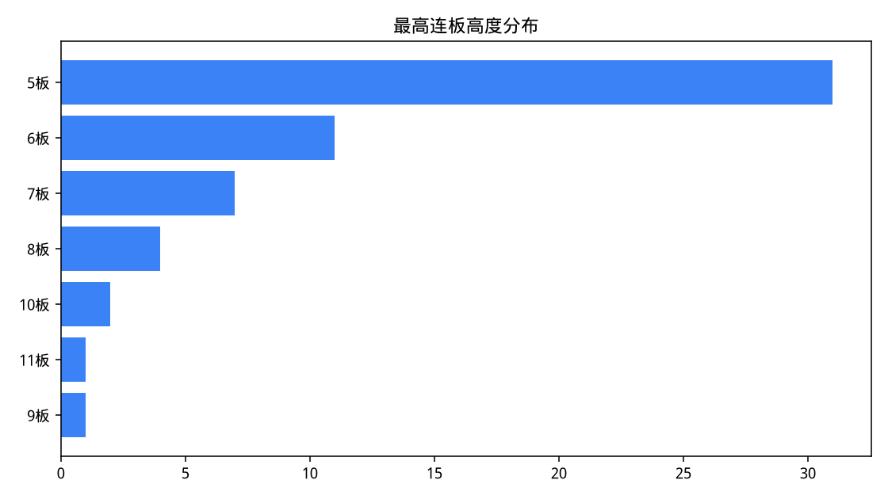
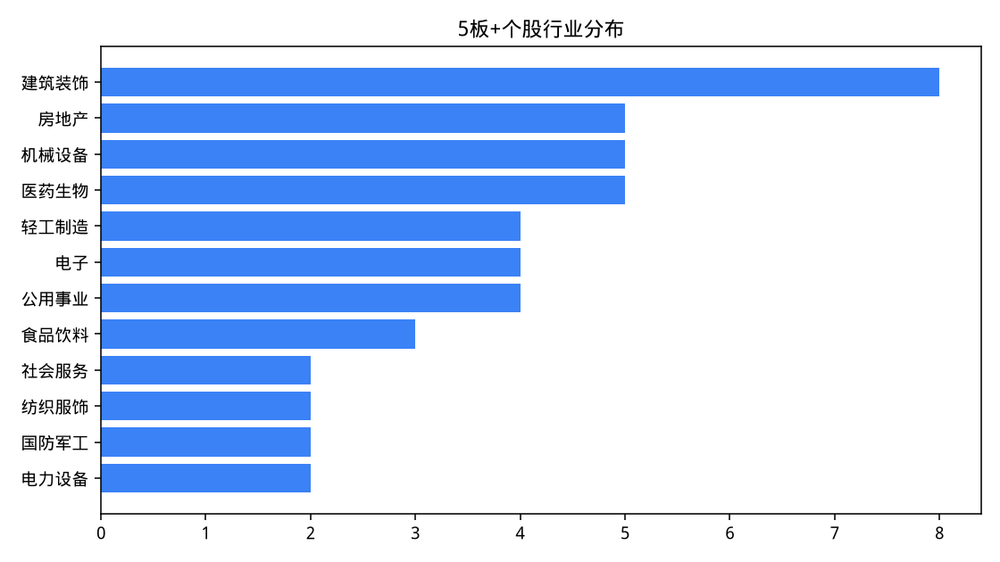
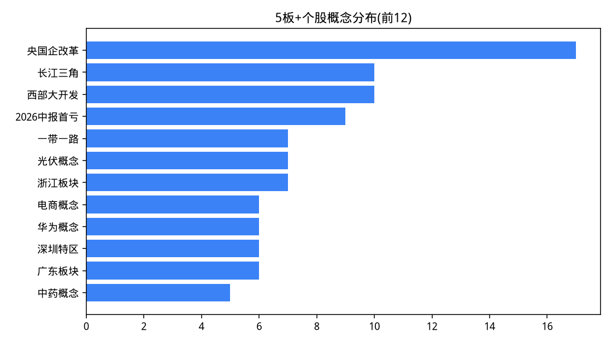
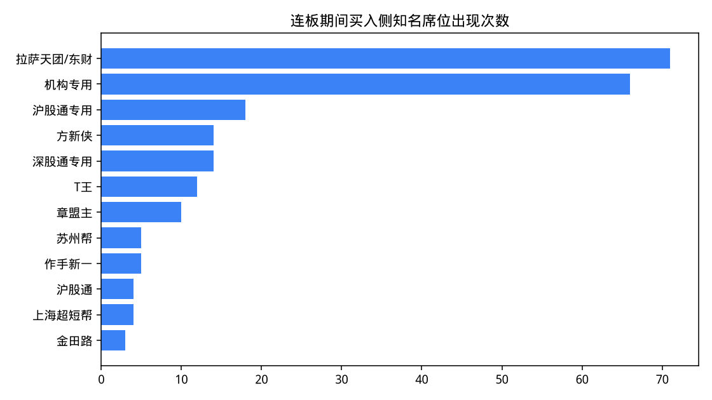

# 近90个交易日「连板≥5」个股与龙虎榜特征

- 样本窗口：2026-04-20 至 2026-08-27（90 个交易日）
- 数据截止：2026-08-27（上证指数最近一根日 K）
- 筛选标准：窗口内用不复权日 K 识别的最高连板天数 ≥ 5（10%/20%/30%/ST 5%）
- 命中个股：**57** 只；命中连板周期：**57** 段
- 数据来源：腾讯财经日 K、东方财富龙虎榜/涨停池/F10

> 连板高度按不复权收盘价是否触及涨停价累计。若周期从窗口前延续进来，高度可能大于窗口内可见涨停天数。同一只股票多段 5 板+周期会分别统计，个股共性按「最高的一段」去重。

## 1. 样本名单

| 代码 | 名称 | 最高连板 | 周期 | 行业 | 板块 | 流通市值 | 峰值价 | 周期均换手% | 地域 | 次新 | ST |
| --- | --- | --- | --- | --- | --- | --- | --- | --- | --- | --- | --- |
| 600381 | *ST春天 | 11 | 2026-04-28 ~ 2026-05-15 | 食品饮料 | ST/沪市主板 | 31.2亿 | 5.31 |  | 青海板块 |  | 是 |
| 603221 | 爱丽家居 | 10 | 2026-07-21 ~ 2026-08-06 | 轻工制造 | 沪市主板 | 60.1亿 | 24.79 |  | 江苏板块 |  |  |
| 000609 | *ST中迪 | 10 | 2026-04-20 ~ 2026-05-07 | 房地产 | ST/深市主板 | 46.2亿 | 15.90 |  | 北京板块 |  | 是 |
| 002207 | *ST准油 | 9 | 2026-04-30 ~ 2026-05-15 | 石油石化 | ST/深市主板 | 26.5亿 | 10.15 |  | 新疆板块 |  | 是 |
| 003032 | 传智教育 | 8 | 2026-07-27 ~ 2026-08-05 | 社会服务 | 深市主板 | 33.4亿 | 11.73 |  | 江苏板块 |  |  |
| 603137 | 恒尚节能 | 8 | 2026-06-15 ~ 2026-07-09 | 建筑装饰 | 沪市主板 | 46.1亿 | 25.20 |  | 江苏板块 |  |  |
| 002514 | *ST宝馨 | 8 | 2026-05-11 ~ 2026-05-20 | 机械设备 | ST/深市主板 | 24.0亿 | 4.33 |  | 江苏板块 |  | 是 |
| 001259 | 利仁科技 | 8 | 2026-05-11 ~ 2026-05-20 | 家用电器 | 深市主板 | 38.3亿 | 80.53 |  | 北京板块 |  |  |
| 600721 | 百花医药 | 7 | 2026-08-04 ~ 2026-08-12 | 医药生物 | 沪市主板 | 54.0亿 | 14.03 |  | 新疆板块 |  |  |
| 002822 | ST中装 | 7 | 2026-06-23 ~ 2026-07-01 | 房地产 | ST/深市主板 | 35.9亿 | 3.36 |  | 广东板块 |  | 是 |
| 002674 | 兴业科技 | 7 | 2026-06-18 ~ 2026-06-29 | 纺织服饰 | 深市主板 | 92.7亿 | 31.70 |  | 福建板块 |  |  |
| 600265 | *ST景谷 | 7 | 2026-05-26 ~ 2026-06-03 | 农林牧渔 | ST/沪市主板 | 36.7亿 | 28.30 |  | 云南板块 |  | 是 |
| 600745 | *ST闻泰 | 7 | 2026-05-25 ~ 2026-06-02 | 电子 | ST/沪市主板 | 290.3亿 | 22.79 |  | 湖北板块 |  | 是 |
| 603779 | 威龙股份 | 7 | 2026-05-13 ~ 2026-05-21 | 食品饮料 | 沪市主板 | 48.2亿 | 14.52 |  | 山东板块 |  |  |
| 600730 | *ST高科 | 7 | 2026-04-29 ~ 2026-05-12 | 社会服务 | ST/沪市主板 | 67.2亿 | 11.45 |  | 北京板块 |  | 是 |
| 000017 | 深中华A | 6 | 2026-08-20 ~ 2026-08-27 | 纺织服饰 | 深市主板 | 45.9亿 | 10.41 |  | 广东板块 |  |  |
| 001258 | 立新能源 | 6 | 2026-07-16 ~ 2026-07-23 | 公用事业 | 深市主板 | 113.0亿 | 12.11 |  | 新疆板块 |  |  |
| 000078 | ST海王 | 6 | 2026-07-01 ~ 2026-07-08 | 医药生物 | ST/深市主板 | 52.0亿 | 1.98 |  | 广东板块 |  | 是 |
| 002175 | *ST东智 | 6 | 2026-06-22 ~ 2026-07-06 | 机械设备 | ST/深市主板 | 36.6亿 | 2.87 |  | 广西板块 |  | 是 |
| 000004 | 国华退 | 6 | 2026-06-26 ~ 2026-07-03 | -- | ST/深市主板 | 0.6亿 | 0.45 |  | 广东 |  | 是 |
| 603595 | ST东尼 | 6 | 2026-06-18 ~ 2026-06-26 | 电子 | ST/沪市主板 | 86.0亿 | 36.98 |  | 浙江板块 |  | 是 |
| 600403 | 大有能源 | 6 | 2026-06-01 ~ 2026-06-08 | 煤炭 | 沪市主板 | 214.0亿 | 8.95 |  | 河南板块 |  |  |
| 002323 | *ST雅博 | 6 | 2026-05-25 ~ 2026-06-01 | 建筑装饰 | ST/深市主板 | 32.7亿 | 1.54 |  | 山东板块 |  | 是 |
| 002918 | 蒙娜丽莎 | 6 | 2026-05-08 ~ 2026-05-15 | 轻工制造 | 深市主板 | 39.9亿 | 18.63 |  | 广东板块 |  |  |
| 601991 | 大唐发电 | 6 | 2026-05-06 ~ 2026-05-13 | 公用事业 | 沪市主板 | 913.6亿 | 7.37 |  | 北京板块 |  |  |
| 002297 | 博云新材 | 6 | 2026-04-13 ~ 2026-04-20 | 国防军工 | 深市主板 | 111.5亿 | 19.46 |  | 湖南板块 |  |  |
| 003040 | 楚天龙 | 5 | 2026-08-21 ~ 2026-08-27 | 通信 | 深市主板 | 85.6亿 | 18.73 |  | 广东板块 |  |  |
| 002412 | 汉森制药 | 5 | 2026-08-19 ~ 2026-08-25 | 医药生物 | 深市主板 | 61.4亿 | 12.33 |  | 湖南板块 |  |  |
| 300862 | 蓝盾光电 | 5 | 2026-08-10 ~ 2026-08-14 | 机械设备 | 创业板 | 71.6亿 | 47.29 |  | 安徽板块 |  |  |
| 603758 | 秦安股份 | 5 | 2026-08-07 ~ 2026-08-13 | 汽车 | 沪市主板 | 66.5亿 | 15.35 |  | 重庆板块 |  |  |
| 600272 | 开开实业 | 5 | 2026-08-06 ~ 2026-08-12 | 医药生物 | 沪市主板 | 28.0亿 | 17.27 |  | 上海板块 |  |  |
| 002552 | 宝鼎科技 | 5 | 2026-08-04 ~ 2026-08-10 | 电子 | 深市主板 | 192.9亿 | 52.36 |  | 浙江板块 |  |  |
| 002963 | 豪尔赛 | 5 | 2026-07-31 ~ 2026-08-06 | 建筑装饰 | 深市主板 | 28.9亿 | 19.35 |  | 北京板块 |  |  |
| 002827 | 高争民爆 | 5 | 2026-07-29 ~ 2026-08-04 | 基础化工 | 深市主板 | 115.6亿 | 41.87 |  | 西藏板块 |  |  |
| 605179 | 一鸣食品 | 5 | 2026-07-28 ~ 2026-08-03 | 食品饮料 | 沪市主板 | 85.5亿 | 21.31 |  | 浙江板块 |  |  |
| 002879 | 长缆科技 | 5 | 2026-07-21 ~ 2026-07-27 | 电力设备 | 深市主板 | 27.2亿 | 19.86 |  | 湖南板块 |  |  |
| 600664 | 哈药股份 | 5 | 2026-07-10 ~ 2026-07-16 | 医药生物 | 沪市主板 | 124.4亿 | 4.94 |  | 黑龙江 |  |  |
| 600491 | ST龙元 | 5 | 2026-07-01 ~ 2026-07-14 | 建筑装饰 | ST/沪市主板 | 24.9亿 | 1.35 |  | 浙江板块 |  | 是 |
| 600793 | 宜宾纸业 | 5 | 2026-07-01 ~ 2026-07-07 | 轻工制造 | 沪市主板 | 34.3亿 | 19.37 |  | 四川板块 |  |  |
| 603789 | ST星农 | 5 | 2026-06-23 ~ 2026-07-06 | 机械设备 | ST/沪市主板 | 18.2亿 | 6.99 |  | 浙江板块 |  | 是 |
| 002977 | *ST天箭 | 5 | 2026-06-30 ~ 2026-07-06 | 国防军工 | ST/深市主板 | 17.2亿 | 25.84 |  | 四川板块 |  | 是 |
| 000909 | *ST数源 | 5 | 2026-06-30 ~ 2026-07-06 | 房地产 | ST/深市主板 | 20.2亿 | 4.61 |  | 浙江板块 |  | 是 |
| 600180 | *ST瑞茂 | 5 | 2026-06-26 ~ 2026-07-02 | 交通运输 | ST/沪市主板 | 15.0亿 | 1.38 |  | 山东板块 |  | 是 |
| 600397 | 江钨装备 | 5 | 2026-06-16 ~ 2026-06-23 | 机械设备 | 沪市主板 | 241.9亿 | 24.44 |  | 江西板块 |  |  |
| 600353 | 旭光电子 | 5 | 2026-06-15 ~ 2026-06-22 | 电子 | 沪市主板 | 383.0亿 | 46.21 |  | 四川板块 |  |  |
| 600537 | *ST亿晶 | 5 | 2026-06-11 ~ 2026-06-17 | 电力设备 | ST/沪市主板 | 35.4亿 | 2.99 |  | 浙江板块 |  | 是 |
| 002717 | *ST岭南 | 5 | 2026-06-02 ~ 2026-06-08 | 建筑装饰 | ST/深市主板 | 20.1亿 | 1.17 |  | 广东板块 |  | 是 |
| 600726 | 华电能源 | 5 | 2026-05-25 ~ 2026-05-29 | 公用事业 | 沪市主板 | 757.3亿 | 10.13 |  | 黑龙江 |  |  |
| 600162 | 香江控股 | 5 | 2026-05-25 ~ 2026-05-29 | 房地产 | 沪市主板 | 91.2亿 | 2.79 |  | 广东板块 |  |  |
| 000056 | *ST皇庭 | 5 | 2026-05-25 ~ 2026-05-29 | 房地产 | ST/深市主板 | 14.5亿 | 1.60 |  | 广东板块 |  | 是 |
| 603378 | *ST亚士 | 5 | 2026-05-12 ~ 2026-05-18 | 建筑材料 | ST/沪市主板 | 24.2亿 | 5.64 |  | 上海板块 |  | 是 |
| 002856 | *ST美芝 | 5 | 2026-05-11 ~ 2026-05-15 | 建筑装饰 | ST/深市主板 | 22.3亿 | 17.98 |  | 广东板块 |  | 是 |
| 603828 | *ST利达 | 5 | 2026-04-30 ~ 2026-05-11 | 建筑装饰 | ST/沪市主板 | 34.7亿 | 5.82 |  | 江苏板块 |  | 是 |
| 603045 | 福达合金 | 5 | 2026-04-30 ~ 2026-05-11 | 有色金属 | 沪市主板 | 92.6亿 | 68.35 |  | 浙江板块 |  |  |
| 002081 | 金 螳 螂 | 5 | 2026-04-28 ~ 2026-05-07 | 建筑装饰 | 深市主板 | 188.8亿 | 7.14 |  | 江苏板块 |  |  |
| 603272 | *ST联翔 | 5 | 2026-04-24 ~ 2026-05-06 | 轻工制造 | ST/沪市主板 | 29.2亿 | 28.14 |  | 浙江板块 |  | 是 |
| 603318 | 水发燃气 | 5 | 2026-04-22 ~ 2026-04-28 | 公用事业 | 沪市主板 | 63.3亿 | 13.78 |  | 辽宁板块 |  |  |

### 1.1 先把 ST/退市整理 和正常股分开

57 只里 **ST/退市 25 只（43.9%）**，非 ST **32 只**。ST 是 5% 涨停，5 连板累计大约 28%，只相当于普通 10cm 票的 2～3 板；后面的市值、龙虎榜、游资结论以非 ST 为主，ST 单独看成「壳/重组炒作」。

非 ST 最高 10 板（爱丽家居(10板)、传智教育(8板)、恒尚节能(8板)），流通市值中位数 78.5 亿。

ST 最高 11 板（*ST春天(11板)、*ST中迪(10板)、*ST准油(9板)），这是 5% 台阶堆出来的高度，和 10cm 龙头不是一类交易。

## 2. 个股共同特点

### 2.1 连板高度

| 最高连板 | 数量 | 占比 |
| --- | --- | --- |
| 5 | 31 | 54.4% |
| 6 | 11 | 19.3% |
| 7 | 7 | 12.3% |
| 8 | 4 | 7.0% |
| 10 | 2 | 3.5% |
| 11 | 1 | 1.8% |
| 9 | 1 | 1.8% |

中位数 5 板，窗口内最高 11 板：*ST春天(600381)。

### 2.2 上市板块

| 板块 | 数量 | 占比 |
| --- | --- | --- |
| 沪市主板 | 17 | 29.8% |
| 深市主板 | 14 | 24.6% |
| ST/深市主板 | 13 | 22.8% |
| ST/沪市主板 | 12 | 21.1% |
| 创业板 | 1 | 1.8% |

非 ST 主板 31 只（54.4%），创业板 1 只，科创板 0 只，ST/退市 25 只（43.9%）。窗口里几乎没有 20cm 科创/创业板的 5 板龙头，空间板主要发生在 10cm 主板；ST 则贡献了四成以上的「连板计数」。

### 2.3 流通市值（取最高板当日）

| 流通市值 | 数量 | 占比 |
| --- | --- | --- |
| 20-50亿 | 26 | 45.6% |
| 50-100亿 | 14 | 24.6% |
| >200亿 | 6 | 10.5% |
| 100-200亿 | 6 | 10.5% |
| <20亿 | 5 | 8.8% |

峰值流通市值中位数 **46.1 亿**，均值 98.1 亿，最小 0.6 亿，最大 913.6 亿。54.4% 的个股峰值流通市值低于 50 亿。

### 2.4 股价

| 股价 | 数量 | 占比 |
| --- | --- | --- |
| 10-20元 | 20 | 35.1% |
| <5元 | 14 | 24.6% |
| 20-50元 | 13 | 22.8% |
| 5-10元 | 7 | 12.3% |
| >50元 | 3 | 5.3% |

峰值价中位数 13.78 元。低价股更容易用较少资金封出连板。

### 2.5 行业与概念（题材扎堆）

| 行业 | 数量 | 占比 |
| --- | --- | --- |
| 建筑装饰 | 8 | 14.0% |
| 房地产 | 5 | 8.8% |
| 机械设备 | 5 | 8.8% |
| 医药生物 | 5 | 8.8% |
| 轻工制造 | 4 | 7.0% |
| 电子 | 4 | 7.0% |
| 公用事业 | 4 | 7.0% |
| 食品饮料 | 3 | 5.3% |
| 社会服务 | 2 | 3.5% |
| 纺织服饰 | 2 | 3.5% |
| 国防军工 | 2 | 3.5% |
| 电力设备 | 2 | 3.5% |
| 石油石化 | 1 | 1.8% |
| 家用电器 | 1 | 1.8% |
| 农林牧渔 | 1 | 1.8% |

| 概念 | 数量 | 占比 |
| --- | --- | --- |
| 央国企改革 | 17 | 29.8% |
| 长江三角 | 10 | 17.5% |
| 西部大开发 | 10 | 17.5% |
| 2026中报首亏 | 9 | 15.8% |
| 一带一路 | 7 | 12.3% |
| 光伏概念 | 7 | 12.3% |
| 浙江板块 | 7 | 12.3% |
| 电商概念 | 6 | 10.5% |
| 华为概念 | 6 | 10.5% |
| 深圳特区 | 6 | 10.5% |
| 广东板块 | 6 | 10.5% |
| 中药概念 | 5 | 8.8% |
| 半导体概念 | 5 | 8.8% |
| 2026中报扭亏 | 5 | 8.8% |
| 昨日高换手 | 5 | 8.8% |
| 装修装饰Ⅱ | 5 | 8.8% |
| 百日新高 | 5 | 8.8% |
| 近期新高 | 5 | 8.8% |
| 2026中报预增 | 5 | 8.8% |
| PPP模式 | 5 | 8.8% |

样本里行业并不高度集中（第一名 建筑装饰 仅 14.0%）。更明显的共性是时间扎堆：高潮周里不同行业的龙头各自走完 5 板，而不是同一细分子行业包圆。

按最高板所在周的分布（看高潮是否扎堆）：

| 自然周 | 数量 | 占比 |
| --- | --- | --- |
| 2026-W20 | 8 | 14.0% |
| 2026-W28 | 7 | 12.3% |
| 2026-W32 | 5 | 8.8% |
| 2026-W33 | 5 | 8.8% |
| 2026-W21 | 4 | 7.0% |
| 2026-W27 | 4 | 7.0% |
| 2026-W19 | 3 | 5.3% |
| 2026-W23 | 3 | 5.3% |
| 2026-W35 | 3 | 5.3% |
| 2026-W26 | 3 | 5.3% |
| 2026-W22 | 3 | 5.3% |
| 2026-W24 | 2 | 3.5% |
| 2026-W29 | 2 | 3.5% |
| 2026-W30 | 1 | 1.8% |
| 2026-W17 | 1 | 1.8% |

### 2.6 地域

| 地域 | 数量 | 占比 |
| --- | --- | --- |
| 广东板块 | 9 | 15.8% |
| 浙江板块 | 9 | 15.8% |
| 江苏板块 | 6 | 10.5% |
| 北京板块 | 5 | 8.8% |
| 新疆板块 | 3 | 5.3% |
| 山东板块 | 3 | 5.3% |
| 湖南板块 | 3 | 5.3% |
| 四川板块 | 3 | 5.3% |
| 上海板块 | 2 | 3.5% |
| 黑龙江 | 2 | 3.5% |
| 青海板块 | 1 | 1.8% |
| 福建板块 | 1 | 1.8% |

### 2.7 次新与 ST

上市不满 1 年的次新 0 只（0.0%），ST/退市 25 只（43.9%）。本窗口次新并未成为 5 板主力。ST 是 5% 涨停，和 10cm 票的空间、龙虎榜参与者都不是一类。

### 2.8 封板质量（涨停池微观）

5 板及以上交易日样本 113 条；其中东方财富涨停池能对上封单/炸板的约 35 条（该接口大约只保留最近两周）。一字板占比 **41.6%**，集合竞价（09:25）封板占比 **40.0%**，平均炸板次数 4.3，平均换手率 19.2%。

| 连板数 | 样本 | 09:25封板占比 | 一字板占比 | 平均换手% | 平均炸板次数 | 平均封单(亿) |
| --- | --- | --- | --- | --- | --- | --- |
| 1 | 56 | 1.8% | 23.2% | 3.62 | 0.60 | 0.23 |
| 2 | 56 | 5.4% | 46.4% | 5.70 | 1.50 | 0.21 |
| 3 | 56 | 8.9% | 53.6% | 3.76 | 0.0000 | 0.24 |
| 4 | 56 | 5.4% | 35.7% | 12.35 | 3.88 | 0.38 |
| 5 | 56 | 5.4% | 35.7% | 18.11 | 4.14 | 0.18 |
| 6 | 26 | 3.8% | 42.3% | 15.45 | 1.50 | 0.15 |
| 7 | 15 | 0.0% | 53.3% | 34.43 | 11.00 | 0.06 |
| 8 | 8 | 0.0% | 62.5% |  |  | 0.0000 |
| 9 | 4 | 0.0% | 50.0% |  |  | 0.0000 |
| 10 | 3 | 0.0% | 33.3% |  |  | 0.0000 |
| 11 | 1 | 0.0% | 0.0% |  |  | 0.0000 |

常见结构：低位更容易一字/早封，到 5 板附近换手抬升、炸板变多，说明高位分歧加大、需要更大成交额维持。

### 2.9 分布图

## 3. 龙虎榜特点

连板周期内股票-交易日共 337 条，对得上龙虎榜（去重后）148 条，上榜率 **43.9%**。主板首板不一定进「日涨幅偏离值达到 7% 的前 5 只」；3 板之后「连续三个交易日涨幅偏离值累计达到 20%」几乎必上榜。ST 的偏离值门槛更低，上榜更勤，但席位含金量通常不如 10cm 龙头。

### 3.1 上榜原因

| 上榜原因 | 数量 | 占比 |
| --- | --- | --- |
| 连续三个交易日内，涨幅偏离值累计达到20%的证券 | 28 | 18.9% |
| 非ST、*ST和S证券连续三个交易日内收盘价格涨幅偏离值累计达到20%的证券 | 22 | 14.9% |
| 连续三个交易日内，涨幅偏离值累计达到12%的ST证券、*ST证券和未完成股改证券 | 22 | 14.9% |
| ST、*ST证券连续三个交易日内收盘价格涨幅偏离值累计达到12%的证券 | 20 | 13.5% |
| 非S证券连续三个交易日内收盘价格涨幅偏离值累计达到20%的证券 | 15 | 10.1% |
| 有价格涨跌幅限制的日收盘价格涨幅偏离值达到7%的前五只证券 | 13 | 8.8% |
| 退市整理期 | 6 | 4.1% |
| 有价格涨跌幅限制的日换手率达到20%的前五只证券 | 5 | 3.4% |
| 日涨幅偏离值达到7%的前5只证券 | 5 | 3.4% |
| 日涨幅达到15%的前5只证券 | 2 | 1.4% |

### 3.2 净买额随连板高度变化

| 连板数 | 样本日 | 上榜率相关 | 平均净买额(亿) | 净买入占比 | 平均买入(亿) | 平均卖出(亿) | 平均成交额占比% | 出现机构占比 |
| --- | --- | --- | --- | --- | --- | --- | --- | --- |
| 1 | 10 |  | 0.39 | 90.0% | 0.92 | 0.54 | 76.17 | 10.0% |
| 2 | 26 |  | 0.46 | 92.3% | 1.26 | 0.80 | 48.60 | 23.1% |
| 3 | 32 |  | 0.11 | 62.5% | 1.02 | 0.91 | 49.00 | 18.8% |
| 4 | 22 |  | 0.23 | 59.1% | 0.85 | 0.62 | 59.44 | 22.7% |
| 5 | 27 |  | 0.46 | 74.1% | 2.06 | 1.59 | 40.30 | 29.6% |
| 6 | 14 |  | 0.24 | 57.1% | 1.28 | 1.04 | 45.03 | 21.4% |
| 7 | 7 |  | 0.39 | 71.4% | 2.68 | 2.29 | 49.21 | 14.3% |
| 8 | 5 |  | 0.13 | 60.0% | 4.62 | 4.49 | 69.52 | 20.0% |
| 9 | 4 |  | -0.10 | 50.0% | 0.48 | 0.58 | 32.85 | 25.0% |
| 11 | 1 |  | 0.0077 | 100.0% | 0.23 | 0.22 | 18.26 | 0.0% |

5 板+当日：平均龙虎榜净买额 **0.32 亿**，净买入（净额>0）占比 67.2%，解读含「机构」占比 24.1%（样本 58）。

| 阶段 | 样本 | 平均净买(亿) | 净买入占比 | 平均成交额占比% | 机构出现占比 |
| --- | --- | --- | --- | --- | --- |
| 低位(1-2板) | 36 | 0.44 | 91.7% | 56.26 | 19.4% |
| 中位(3-4板) | 54 | 0.16 | 61.1% | 53.26 | 20.4% |
| 高位(5板+) | 58 | 0.32 | 67.2% | 44.14 | 24.1% |

低位平均净买 0.44 亿（净买入占比 92%），高位平均净买 0.32 亿（净买入占比 67%）。高位买额 2.02 亿、卖额 1.70 亿，买卖同时放大；净额正负看龙头是否还有人愿意抬，均值会被个别大额净买拉偏，更宜看净买入占比和买卖总量。

### 3.3 龙虎榜成交占比

连板周期上榜日，龙虎榜成交额占总成交比均值 **50.4%**，中位数 32.8%。该比例高说明买卖集中在公开席位（游资可见博弈）；比例低则更多是隐形资金/散户。

### 3.4 席位结构

| 席位类型 | 买入席位次数 | 买入额(亿) | 买入净额(亿) | 覆盖个股 |
| --- | --- | --- | --- | --- |
| 其他营业部 | 585 | 303.05 | 234.59 | 56 |
| 北向资金 | 39 | 31.38 | 18.32 | 20 |
| 知名游资 | 65 | 23.49 | 22.25 | 29 |
| 机构 | 66 | 19.46 | 10.14 | 20 |
| 东财散户通道 | 71 | 4.89 | 3.13 | 25 |
| 量化/互联网席位 | 6 | 0.60 | 0.41 | 4 |

买入额口径：知名游资 6.1%，其他营业部 79.2%，东财散户通道 1.3%，机构 5.1%，北向 8.2%，量化/互联网 0.2%。

东财拉萨/山南席位本质是互联网散户通道，不是单一游资。它们频繁出现在 5 板买五，通常表示情绪高潮、跟风盘进场，次日溢价往往变差。

知名游资/通道在买入五档出现次数（含机构专用、东财通道）：

| 别名 | 数量 | 占比 |
| --- | --- | --- |
| 拉萨天团/东财 | 71 | 29.5% |
| 机构专用 | 66 | 27.4% |
| 沪股通专用 | 18 | 7.5% |
| 方新侠 | 14 | 5.8% |
| 深股通专用 | 14 | 5.8% |
| T王 | 12 | 5.0% |
| 章盟主 | 10 | 4.1% |
| 苏州帮 | 5 | 2.1% |
| 作手新一 | 5 | 2.1% |
| 沪股通 | 4 | 1.7% |
| 上海超短帮 | 4 | 1.7% |
| 金田路 | 3 | 1.2% |
| 炒股养家 | 3 | 1.2% |
| 宁波桑田路 | 3 | 1.2% |
| 深股通投资者 | 3 | 1.2% |
| 紫阳东路 | 2 | 0.8% |
| 赵老哥 | 2 | 0.8% |
| 孙哥 | 1 | 0.4% |
| 大小说家 | 1 | 0.4% |

其中 5 板+当日买入侧：

| 别名 | 数量 | 占比 |
| --- | --- | --- |
| 拉萨天团/东财 | 32 | 31.1% |
| 机构专用 | 27 | 26.2% |
| T王 | 7 | 6.8% |
| 方新侠 | 7 | 6.8% |
| 深股通专用 | 5 | 4.9% |
| 沪股通专用 | 4 | 3.9% |
| 沪股通 | 4 | 3.9% |
| 章盟主 | 4 | 3.9% |
| 苏州帮 | 2 | 1.9% |
| 紫阳东路 | 2 | 1.9% |
| 宁波桑田路 | 2 | 1.9% |
| 赵老哥 | 2 | 1.9% |
| 深股通投资者 | 2 | 1.9% |
| 金田路 | 1 | 1.0% |
| 上海超短帮 | 1 | 1.0% |

买入侧营业部出现次数 Top15：

| 营业部 | 类型 | 别名 | 买入上榜次数 | 占比 |
| --- | --- | --- | --- | --- |
| 机构专用 | 机构 | 机构专用 | 66 | 7.9% |
| 国泰海通证券总部 | 其他营业部 |  | 27 | 3.2% |
| 沪股通专用 | 北向资金 | 沪股通专用 | 18 | 2.2% |
| 东方财富证券拉萨东环路第二 | 东财散户通道 | 拉萨天团/东财 | 15 | 1.8% |
| 东方财富证券拉萨金融城南环路 | 东财散户通道 | 拉萨天团/东财 | 15 | 1.8% |
| 深股通专用 | 北向资金 | 深股通专用 | 14 | 1.7% |
| 中信建投证券上海营口路 | 其他营业部 |  | 12 | 1.4% |
| 高盛(中国)证券上海浦东新区世纪大道 | 知名游资 | T王 | 12 | 1.4% |
| 东方财富证券拉萨团结路第二 | 东财散户通道 | 拉萨天团/东财 | 12 | 1.4% |
| 开源证券西安太华路 | 知名游资 | 方新侠 | 12 | 1.4% |
| 东方财富证券山南香曲东路 | 东财散户通道 | 拉萨天团/东财 | 10 | 1.2% |
| 中信证券上海分公司 | 其他营业部 |  | 9 | 1.1% |
| 东方财富证券拉萨团结路第一 | 东财散户通道 | 拉萨天团/东财 | 9 | 1.1% |
| 联储证券宁波分公司 | 其他营业部 |  | 8 | 1.0% |
| 国泰海通证券上海分公司 | 其他营业部 |  | 8 | 1.0% |

买卖重合：148 个上榜日里，有 81 日出现同一营业部同时出现在买五和卖五（席位-日 165 次）。高位重合升高通常是对倒做量或日内 T，不一定是真金白银加仓。

### 3.5 最高板之后的收益（龙虎榜「上榜后N日」）

以每只股票窗口内最高板当日为基准：次日 0.03%（样本30），2 日 2.46%（样本30），5 日 1.89%（样本29）。高位板后平均收益转弱，和龙虎榜高位净卖/散户通道接盘是同一件事的两面。

| 代码 | 名称 | 最高板日 | 高度 | 后1日% | 后2日% | 后5日% |
| --- | --- | --- | --- | --- | --- | --- |
| 600381 | *ST春天 | 20260515 | 11 | 1.32 | -3.77 | -11.68 |
| 002207 | *ST准油 | 20260515 | 9 | -5.02 | -0.30 | -14.38 |
| 003032 | 传智教育 | 20260805 | 8 | -6.65 | -1.96 | 10.06 |
| 002514 | *ST宝馨 | 20260520 | 8 | 3.93 | -1.15 | 11.32 |
| 001259 | 利仁科技 | 20260520 | 8 | 9.28 | -1.65 | -7.12 |
| 600721 | 百花医药 | 20260812 | 7 | 3.35 | -1.57 | -2.21 |
| 002822 | ST中装 | 20260701 | 7 | -2.68 | 2.08 | -6.25 |
| 603779 | 威龙股份 | 20260521 | 7 | -9.99 | -4.82 | -24.93 |
| 001258 | 立新能源 | 20260723 | 6 | 7.60 | 18.33 | 1.98 |
| 000004 | 国华退 | 20260703 | 6 | -8.89 | -11.11 | 2.22 |
| 603595 | ST东尼 | 20260626 | 6 | -5.00 | -9.76 | -2.65 |
| 600403 | 大有能源 | 20260608 | 6 | -9.94 | -14.53 | -27.04 |
| 002323 | *ST雅博 | 20260601 | 6 | -1.95 | 3.25 | -7.14 |
| 002297 | 博云新材 | 20260420 | 6 | -2.42 | 4.27 | 5.50 |
| 002412 | 汉森制药 | 20260825 | 5 | 6.16 | 13.71 |  |
| 300862 | 蓝盾光电 | 20260814 | 5 | 15.82 | 19.48 | 9.54 |
| 600272 | 开开实业 | 20260812 | 5 | -7.35 | 1.91 | 12.91 |
| 002827 | 高争民爆 | 20260804 | 5 | 6.90 | 17.60 | 39.98 |
| 605179 | 一鸣食品 | 20260803 | 5 | 1.78 | 9.53 | 17.88 |
| 002879 | 长缆科技 | 20260727 | 5 | -4.83 | -9.72 | -9.97 |
| 600664 | 哈药股份 | 20260716 | 5 | 7.89 | 7.49 | 21.46 |
| 603789 | ST星农 | 20260706 | 5 | -8.58 | 0.57 | -7.87 |
| 600180 | *ST瑞茂 | 20260702 | 5 | 1.45 | 11.59 | 1.45 |
| 600397 | 江钨装备 | 20260623 | 5 | 4.38 | 5.07 | 11.42 |
| 002717 | *ST岭南 | 20260608 | 5 | 0.85 | -1.71 | 1.71 |
| 600162 | 香江控股 | 20260529 | 5 | 4.66 | 15.05 | 23.30 |
| 002856 | *ST美芝 | 20260515 | 5 | 2.95 | 8.12 | 0.95 |
| 002081 | 金 螳 螂 | 20260507 | 5 | -4.76 | 1.54 | 11.06 |
| 603272 | *ST联翔 | 20260506 | 5 | -5.01 | -7.25 | 7.39 |
| 603318 | 水发燃气 | 20260428 | 5 | 5.59 | 3.48 | -14.01 |

## 4. 综合结论

- **ST 贡献了大量「连板计数」**：25 / 57（43.9%）是 ST/退市整理，5% 台阶堆到 5～11 板。真正接近短线资金认知的 10cm/20cm 五板，是剩下的 32 只。
- **体量偏小、价格不高**：57 只 5 板+的峰值流通市值中位数 46.1 亿，主板 31 只；权重蓝筹几乎不走这种 10cm 连板路径。
- **时间比行业更集中**：最高板落在 2026-W20 的有 8 只（14.0%）。5 板是市场情绪高潮的产物，散落在冷淡周里的独立 5 板很少。
- **越高越分歧**：5 板以上一字板占比 41.6%；低位更容易封死，高位换手和炸板上升（涨停池能覆盖的日子里尤其明显）。
- **龙虎榜低位更齐、高位更吵**：5 板+当日净买入占比 67.2%，平均净买 0.32 亿；机构会出现，但不是高位连板的定价核心。
- **席位以营业部/游资接力为主**：知名游资买入额占比 6.1%，东财拉萨通道 1.3%。东财席位是散户通道温度计，出现不等于有主力锁仓。
- **最高板不是稳盈终点**：有样本的最高板次日平均 0.03%（n=30），继续连板和直接大面会把均值拉得很散，仓位应对的是分布而不是平均数。
- **可复用的观察清单**：情绪高潮周 + 流通市值不是特别大 + 低位龙虎榜净买为正、游资（非东财）在买五；5 板附近若换手陡升、买卖五重合、净额转负，连续性往往结束。

## 5. 方法与局限

- 连板识别用不复权日 K（腾讯财经）：收盘价触及涨停价（10%/20%/30%/ST 5%，1 分钱容差）。东方财富涨停池只能覆盖最近约 15 个交易日，仅用于封单/炸板/首次封板等微观字段。
- 龙虎榜不是全市场成交，只覆盖上榜营业部前五买卖；未上榜不代表没有大资金。
- 游资别名来自公开席位对照，存在分仓、量化混席、营业部更名，只能作统计标签。
- 「上榜后 N 日」收益来自东方财富字段，窗口末尾的高位板可能尚未满 5/10 日。
- 本报告是历史复盘，不是买卖建议。

生成时间：2026-08-27 22:46:23 UTC