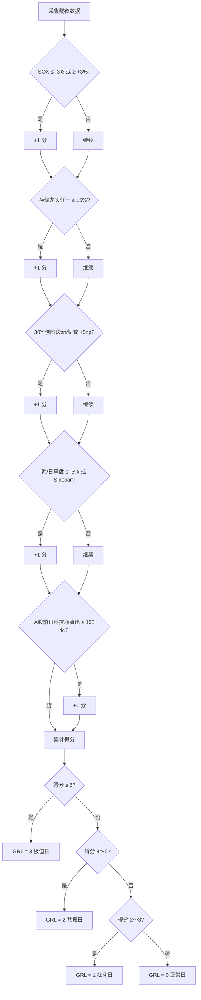
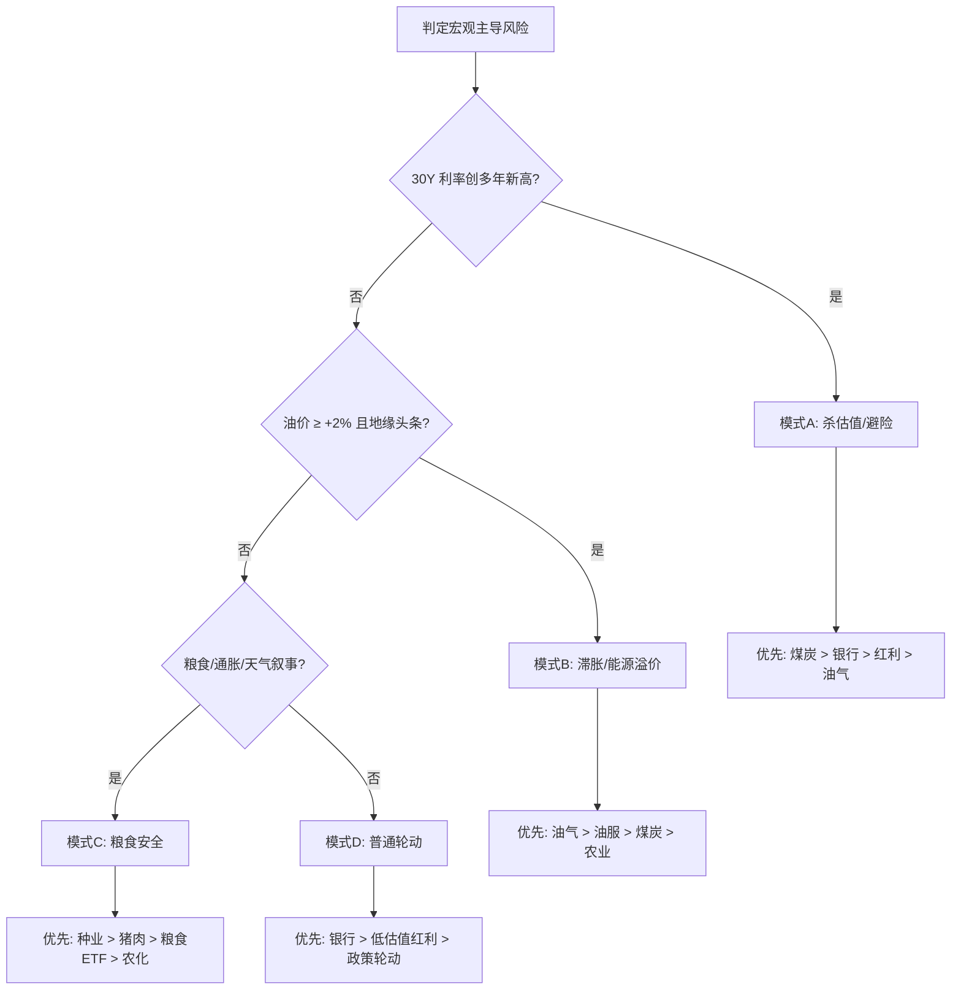
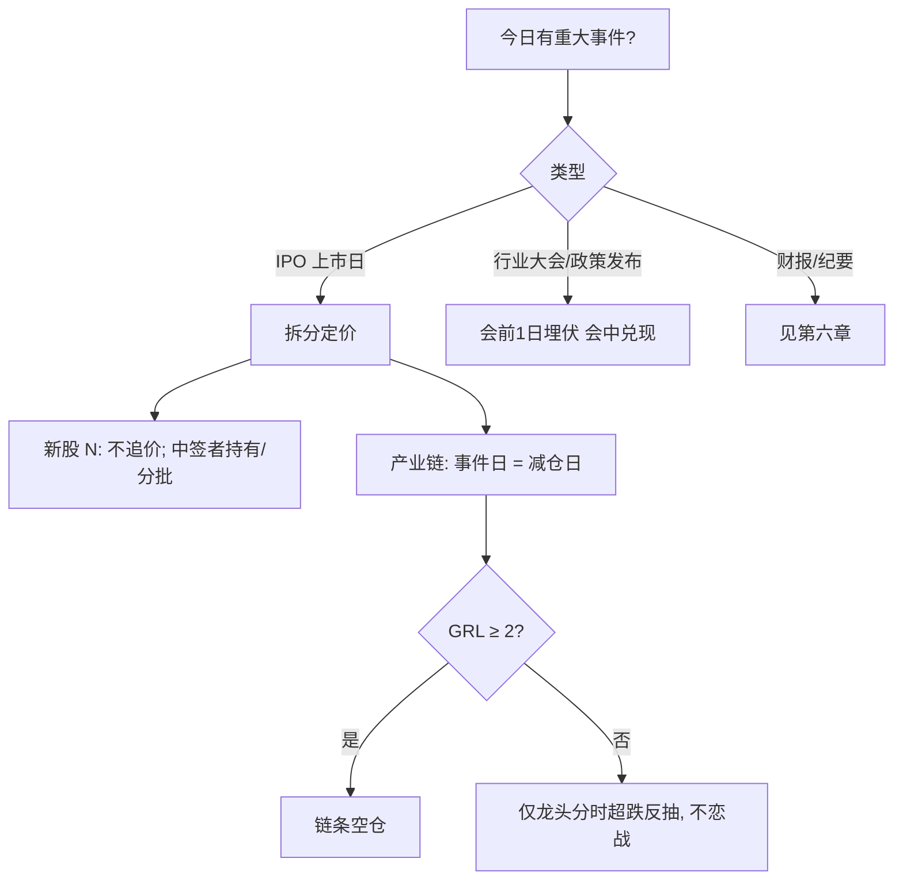

# A股盘前决策树 · 美股异动 → 机会排序

> 适用场景：每日自动化定时报告（盘前）
> 版本：v1.0 · 2026-08-19 复盘后首版
> 核心原则：**先判全球共振等级 → 再定仓位 → 最后排板块优先级**

---

## 使用流程（30 秒版）

```
Step 1  采集隔夜数据（美股/商品/利率/亚洲早盘）
Step 2  计算「全球共振等级」GRL（0～3）
Step 3  查表定「建议仓位」与「科技操作禁令」
Step 4  判定「宏观防御模式」→ 选防御板块优先级
Step 5  扫描「事件日历」→ 拆分新股 vs 产业链
Step 6  输出主线排序 + 操作策略 + 风险提示
```

---

## 一、全球共振等级（GRL）评分

### 1.1 触发信号清单

| 编号 | 信号 | 阈值 | 权重 |
|------|------|------|------|
| R1 | 费城半导体指数（SOX）隔夜涨跌幅 | ≤ **-3%** 或 ≥ **+3%** | +1 |
| R2 | 存储/HDD 龙头（美光/闪迪/SK海力士/希捷） | 任一 **≥ ±5%** | +1 |
| R3 | 30Y 美债收益率 | 创 **≥1 年新高** 或单日 **≥ +5bp** | +1 |
| R4 | 10Y 美债收益率 | **≥ 4.70%** 且较前日上升 | +1 |
| R5 | 亚洲半导体指数（KOSPI/日经/KOSDAQ）早盘 | **≤ -3%** 或触发 **Sidecar/熔断** | +1 |
| R6 | 纳斯达克/科创相关指数 | 隔夜 **≤ -1%** 且 SOX 同向 | +1 |
| R7 | VIX | **≥ +10%** 且 SOX ≤ -3% | +1 |
| R8 | A股前一日科技主力净流出 | **≥ 100 亿** | +1 |
| R9 | 地缘冲击（油价跳涨/霍尔木兹/关税） | 布伦特 **≥ +2%** 或重大头条 | +0.5 |

> 正向共振（全面做多科技）将阈值反向：SOX ≥ +3%、存储龙头集体 ≥ +3%、纳指 ≥ +0.5%。

### 1.2 等级判定

| GRL | 分数 | 定性 | 典型场景 |
|-----|------|------|----------|
| **0** | 0～1 | 正常日 | 美股平盘，无极端利率/地缘 |
| **1** | 2～3 | 扰动日 | 单板块异动，亚洲小幅跟跌 |
| **2** | 4～5 | 共振日 | 费半 ±5%、韩股大幅低开、利率新高 |
| **3** | ≥ 6 | 极值日 | 韩股 Sidecar + 费半 -5% + 30Y 新高 + A股科技前日出逃 |

### 1.3 决策树（Mermaid）



---

## 二、仓位与科技操作禁令

| GRL | 建议仓位 | 科技（存储/半导体/CPO/算力） | 事件股（新股/链条） | 防御板块 |
|-----|----------|------------------------------|---------------------|----------|
| **0** | 6～7 成 | 主线，逢回调低吸 | 按事件日历 | 不配或 1 成对冲 |
| **1** | 5～6 成 | 可持有，不追高开 | 链条可埋伏，不追板 | 1～2 成 |
| **2** | **4～5 成** | **只减不加；禁止开盘抄底** | 链条_event日=兑现日 | 2～3 成 |
| **3** | **≤ 3 成** | **全天禁接飞刀；禁止「等企稳低吸」** | 仅新股申购者参与；链条空仓 | 3～4 成或现金 |

### 2.1 科技操作动词对照（避免模糊）

| 表述 | 适用 GRL | 实际操作 |
|------|----------|----------|
| 逢回调低吸 | 0～1 | 分时回踩 MA5/前低，缩量接 |
| 不追一字板 | 0～2 | 不开板不追 |
| 等企稳再考虑 | **仅 GRL 0～1** | 30～60 分钟缩量横盘 |
| 只减不加 | GRL 2 | 反弹减磅，不新开仓 |
| 全天禁接飞刀 | **GRL 3** | 空仓或仅防御；**取消「企稳低吸」** |

---

## 三、宏观防御模式 → 防御板块优先级

先判「市场在怕什么」，再选防御主线。**不要默认油气。**



| 模式 | 触发条件 | 防御排序 | A股映射 |
|------|----------|----------|---------|
| **A 杀估值** | 30Y 新高 + SOX ≤ -3% + 成长杀跌 | 煤炭 > 银行 > 红利 | 宝泰隆类 / 江苏银行类 / 央企红利 |
| **B 滞胀** | 油价 ≥ $90 且谈判僵局 | 油气 > 油服 > 煤炭 | 三桶油 / 海油工程 / 石化机械 |
| **C 粮食** | 摩根大通/粮农组织通胀预警 + 种业已涨停潮 | 种业 > 猪肉 > 预制菜 | 隆平高科类 / 罗牛山类 |
| **D 普通** | 无极端宏观 | 银行 > 红利 > 政策 | 国有大行 / 高股息 |

**8/19 复盘校正：** GRL=3 + 模式 A → 煤炭 +7.56%、银行逆势，油气仅抗跌。✅

---

## 四、科技主线排序（GRL 分档）

### 4.1 GRL 0～1（正常/扰动）— 原模版逻辑

| 优先级 | 方向 | 条件 |
|--------|------|------|
| 1 | 存储/半导体 | 隔夜存储龙头 **集体上涨** + 费半 **≥ +1%** |
| 2 | CPO/光通信 | 海外光模块 **集体上涨** + 无财报雷 |
| 3 | 铜/有色 | LME 铜现货升水走阔 + 关税囤铜叙事 |
| 4 | 油气 | 油价跳涨 + 政策催化 |
| 5 | 事件（机器人等） | 上市前 1～2 日埋伏 |

### 4.2 GRL 2（共振）— 降级逻辑

| 优先级 | 方向 | 策略 |
|--------|------|------|
| 1 | 防御（按第三章模式） | 可轻仓 |
| 2 | 事件链条 | **仅兑现，不新建仓** |
| 3 | 存储/半导体 | **观察仓；禁止低吸** |
| 4 | CPO | **回避** |
| 5 | 铜/有色 | 观望（金融属性随风险偏好回落） |

### 4.3 GRL 3（极值）— 禁接飞刀

| 优先级 | 方向 | 策略 |
|--------|------|------|
| 1 | 现金 / 防御 | 煤炭+银行 |
| 2 | — | 科技 **全天不做** |
| 3 | — | CPO **全天不做** |
| 4 | 事件 | 仅 **N 新股** 本身；链条 **一律不参与** |

### 4.4 科技内部结构（仅 GRL 0～1 有效）

| 子板块 | 相对强度条件 |
|--------|--------------|
| 存储芯片 | 隔夜存储龙头 **同向** 且 A 股龙头 **前日未大涨** |
| 半导体设备/硅片 | 费半上涨但存储分化；**GRL ≥ 2 时失效** |
| 玻璃基板/先进封装 | 独立材料逻辑；**GRL ≥ 2 时与存储同跌，不可豁免** |

> **8/19 复盘校正：** GRL=3 日「设备/玻璃基板相对安全」**不成立**（电子化学品 -9%、玻璃玻纤 -9%）。

---

## 五、事件股决策树（新股 vs 产业链）



| 标的类型 | 上市/事件日策略 | 8/19 案例 |
|----------|-----------------|-----------|
| **N 新股** | 不追价；中签者可持有 | 宇树 +460% |
| **产业链龙头** | 高开兑现；不接力一字板 | 中大力德等跌停 |
| **高位连板** | 退潮概率 > 延续 | 正裕工业等 |
| **GRL ≥ 2** | 链条 **一律不参与** | — |

---

## 六、关键日历叠加规则

| 事件 | 时间 | 叠加 GRL ≥ 2 时 |
|------|------|-----------------|
| FOMC 纪要 | 公布日 | 仓位 **再降 1 成**；科技不加 |
| LPR 报价 | 公布前一日 | 地产链预期差；**不单独做多地产** |
| 中报密集期 | 8 月 | 无业绩高位题材 **回避** |
| 指数整数关口 | 3980/4000 等 | 关口 + GRL ≥ 2 = **假突破概率↑** |

---

## 七、每日报告输出模版（嵌入决策树）

### 7.1 TL;DR 一句话（必填字段）

```
[GRL=X] 隔夜[最强异动板块]（[核心数据]）；
A股前日[成交额/涨跌比/主线]；
今日[仓位建议]成，[第一方向]但[主要风险]。
```

**示例（8/19）：**
> GRL=3：隔夜存储/半导体崩盘（费半 -5%、韩股 Sidecar），A 股前日已切农业/油气；今日 ≤3 成，只做煤炭/银行防御，科技全天禁接飞刀；宇树链条见光死。

### 7.2 主线排序表（自动生成）

| 排序 | 方向 | GRL 适用 | 策略动词 | 催化 | 风险 |
|------|------|----------|----------|------|------|
| 1 | … | … | … | … | … |

**策略动词词库：** 低吸 / 不追 / 兑现 / 回避 / 观望 / 禁接飞刀

### 7.3 风险提示（GRL 联动）

| GRL | 必提风险 |
|-----|----------|
| ≥ 2 | 全球共振；取消「企稳低吸」表述 |
| ≥ 2 + 整数关口 | 假突破/放量杀跌 |
| ≥ 2 + FOMC/LPR | 尾部风险；仓位上限 |
| 事件日 | 新股≠产业链 |

---

## 八、自动化伪代码

```python
def daily_premarket_report(data):
    grl = score_global_resonance(data)          # 第一章
    position = POSITION_MAP[grl]                 # 第二章
    defense_mode = classify_macro(data)          # 第三章
    defense_rank = DEFENSE_PRIORITY[defense_mode]
    tech_rank = TECH_RANK[grl]                     # 第四章
    event_action = event_tree(data.events, grl)  # 第五章
    calendar_adj = calendar_overlay(data.calendar, grl)

    position = max(0, position - calendar_adj.position_cut)

    return {
        "grl": grl,
        "tldr": render_tldr(grl, data, position, defense_rank[0]),
        "sectors": merge_rankings(defense_rank, tech_rank, event_action),
        "position": position,
        "tech_ban": TECH_BAN[grl],
        "risks": render_risks(grl, data),
    }


def score_global_resonance(d):
    score = 0
    if abs(d.sox_pct) >= 3: score += 1
    if any(abs(x) >= 5 for x in d.memory_stocks): score += 1
    if d.us30y_new_high or d.us30y_chg_bp >= 5: score += 1
    if d.us10y >= 4.70 and d.us10y_chg > 0: score += 1
    if d.kospi_open_pct <= -3 or d.sidecar: score += 1
    if d.nasdaq_pct <= -1 and d.sox_pct <= -3: score += 1
    if d.vix_pct >= 10 and d.sox_pct <= -3: score += 1
    if d.a_share_tech_outflow_yi >= 100: score += 1
    if d.brent_pct >= 2: score += 0.5
    return 0 if score <= 1 else 1 if score <= 3 else 2 if score <= 5 else 3
```

---

## 九、快速查表卡（可贴报告末尾）

```
┌─────────────────────────────────────────────────────────┐
│  GRL │ 仓位  │ 科技        │ 事件链条   │ 防御首选      │
├──────┼───────┼─────────────┼────────────┼───────────────┤
│  0   │ 6-7成 │ 主线低吸    │ 会前埋伏   │ 可选          │
│  1   │ 5-6成 │ 持有不追    │ 不追板     │ 银行/红利     │
│  2   │ 4-5成 │ 只减不加    │ 兑现       │ 煤>银>油气    │
│  3   │ ≤3成  │ 禁接飞刀    │ 不参与     │ 煤+银+现金    │
└─────────────────────────────────────────────────────────┘

宏观：利率新高→煤+银行 | 油价暴涨→油气 | 粮食叙事→种业
事件：新股≠产业链 | GRL≥2 链条一律不做
```

---

## 十、版本记录

| 版本 | 日期 | 变更 |
|------|------|------|
| v1.0 | 2026-08-19 | 首版：GRL 评分、防御四模式、事件拆分、8/19 复盘校正 |
